# Lec 1 - Bài tập Flask API

Thư mục này gồm các bài thực hành Flask API từ B1 đến B6. Mỗi bài có source code riêng trong thư mục tương ứng và ảnh minh họa kết quả trong `asset/`.

## Hướng dẫn chạy

```bash
pip install -r requirements.txt
python B1/app.py
```

Với các bài khác, thay `B1` bằng thư mục bài cần chạy, ví dụ `B2`, `B3`, ...

## Lý thuyết buổi 1 viết tay

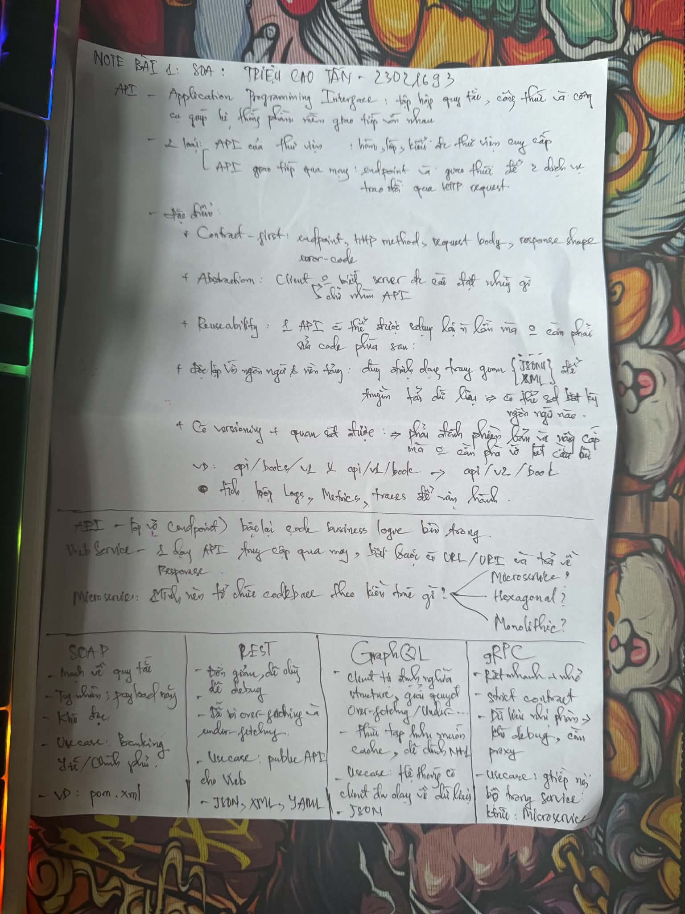

## Bài 1 - Hello API

**Source:** `B1/app.py`

**Endpoint chính:**

- `GET /`: trả về thông điệp `Hello, API!`

| Server | Kết quả |
| --- | --- |
| 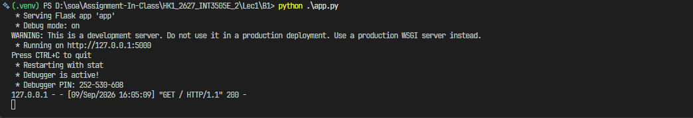 | 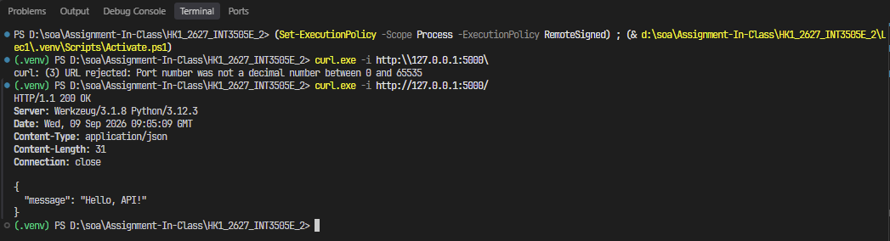 |

## Bài 2 - Health Check và Echo API

**Source:** `B2/app.py`

**Endpoint chính:**

- `GET /health`: kiểm tra trạng thái API
- `POST /echo`: trả về dữ liệu JSON đã gửi lên

| Server | Kết quả |
| --- | --- |
| 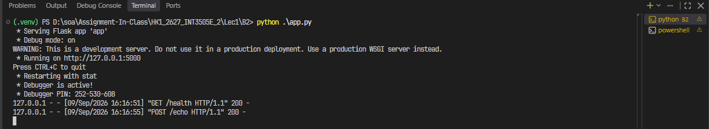 | 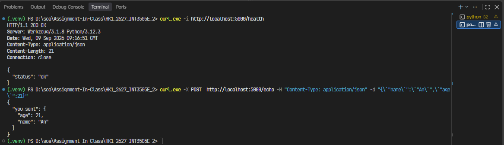 |

## Bài 3 - Tạo Student

**Source:** `B3/app.py`

**Endpoint chính:**

- `POST /students`: tạo sinh viên mới với `name` và `gpa`

| Server | Kết quả |
| --- | --- |
| 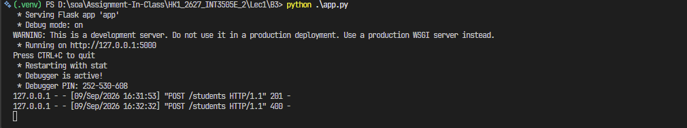 | 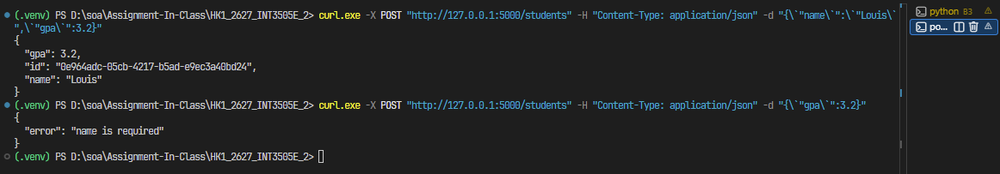 |

## Bài 4 - Books API và Query Parameters

**Source:** `B4/app.py`

**Endpoint chính:**

- `GET /books`: lấy danh sách sách, hỗ trợ `limit` và `q`
- `GET /books/<book_id>`: lấy thông tin sách theo id
- `GET /items/<item_id>`: lấy thông tin item theo id dạng số

| Server | Kết quả |
| --- | --- |
| 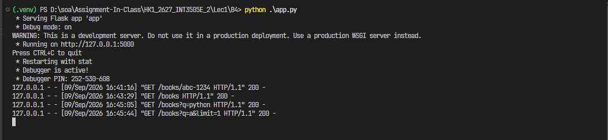 | 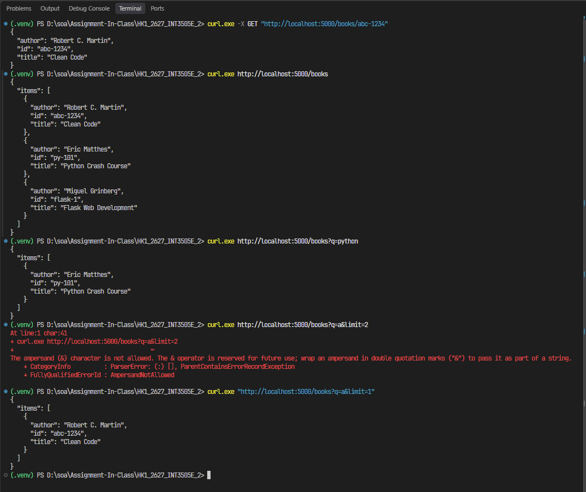 |

## Bài 5 - Xóa Order

**Source:** `B5/app.py`

**Endpoint chính:**

- `DELETE /orders/<order_id>`: xóa đơn hàng nếu trạng thái cho phép

| Server | Kết quả |
| --- | --- |
| 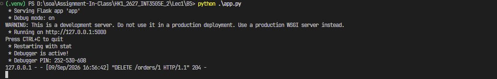 | 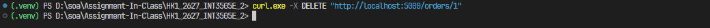 |

## Bài 6 - CRUD Books API

**Source:** `B6/app.py`

**Endpoint chính:**

- `GET /books`: lấy danh sách sách
- `GET /books/<bid>`: lấy thông tin sách theo id
- `POST /books`: tạo sách mới
- `PUT /books/<bid>`: cập nhật sách
- `DELETE /books/<bid>`: xóa sách

| Server | Kết quả |
| --- | --- |
| 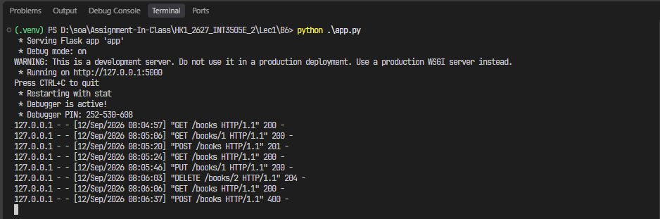 | 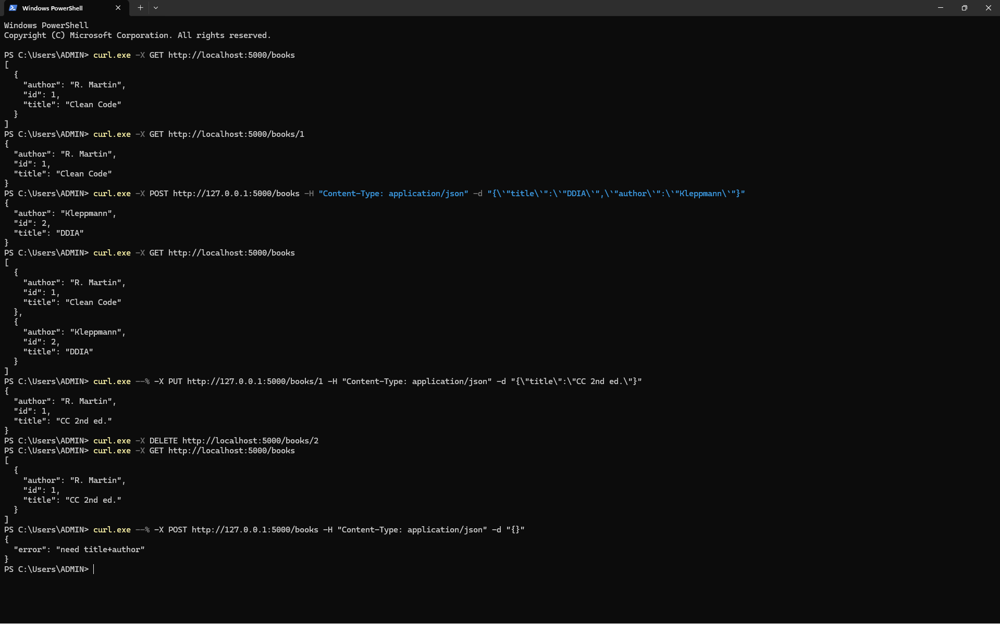 |

## Homework

### Bài 1 - 3 Public API của một domain quan tâm

**Domain:** UET - LMS - API

1. POST [API-GraphQL: api/graphQL](https://portal.uet.vnu.edu.vn/api/graphql)
   - Auth: session-cookie
   - Versioning: Không có
   - Resource Identifiers: Int: trong request payload, mục `variables.courseId`

2. GET [API-REST: courses/7040/modules/progressions](https://portal.uet.vnu.edu.vn/courses/7040/modules/progressions)
   - Auth: session-cookie
   - Versioning: Không có
   - Resource Identifiers: Int: `7040`

3. GET [API-REST: /api/v1/planner/items?start_date=2026-08-28T17%3A00%3A00.000Z&filter=incomplete_items&order=asc&per_page=14&context_codes%5B%5D=course_7040&context_codes%5B%5D=user_3372](https://portal.uet.vnu.edu.vn/api/v1/planner/items?start_date=2026-08-28T17%3A00%3A00.000Z&filter=incomplete_items&order=asc&per_page=14&context_codes%5B%5D=course_7040&context_codes%5B%5D=user_3372)
   - Auth: session-cookie
   - Versioning: v1
   - Resource Identifiers: Int: `course_7040`, `user_3372`

### Bài 3 mở rộng - Thêm API ở bài 6

- `GET /books?q=...`: tìm kiếm sách theo `title` hoặc `author`
- `GET /books?sort=title`: sắp xếp danh sách sách theo `title`
- `POST /books`: bắt buộc field `year` là số lớn hơn hoặc bằng `1900`
- `PUT /books/<bid>`: nếu cập nhật `year` thì `year` phải là số lớn hơn hoặc bằng `1900`

| Server | Kết quả 1 | Kết quả 2 |
| --- | --- | --- |
| 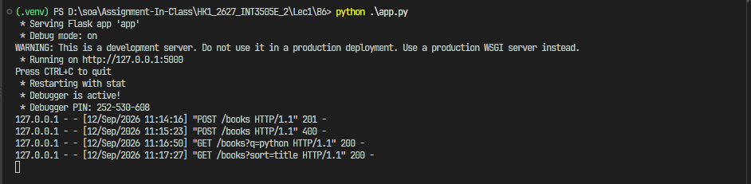 | 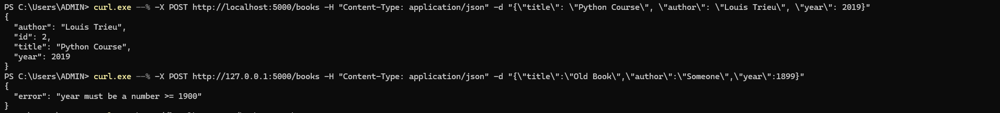 | 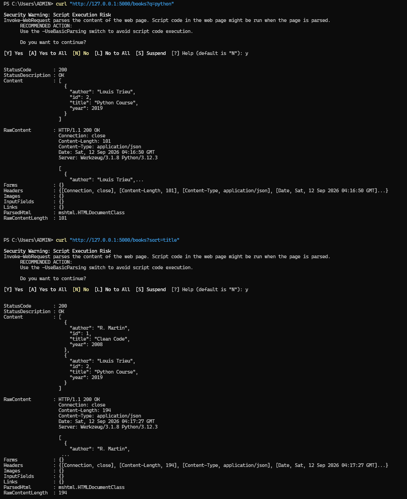 |
