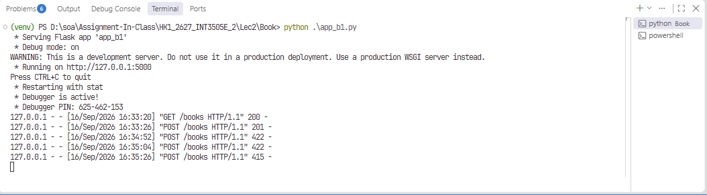
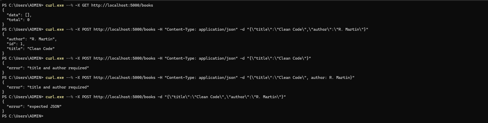
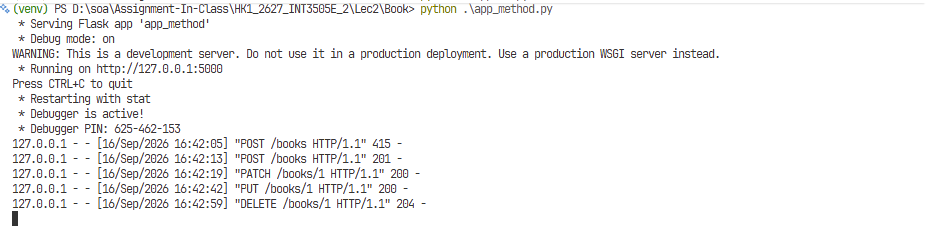
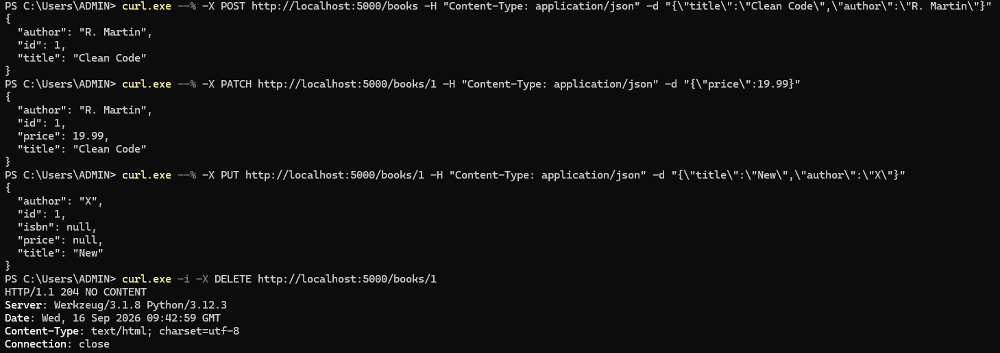
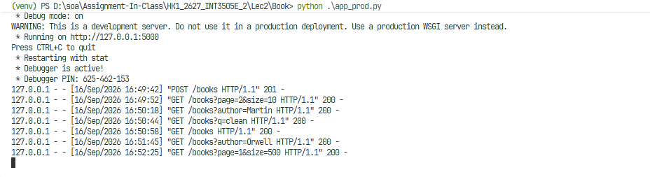
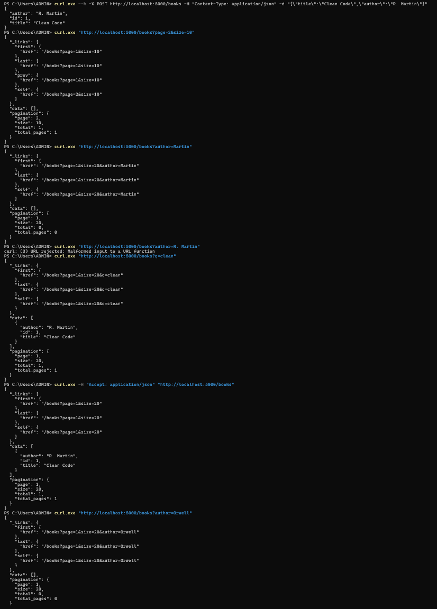
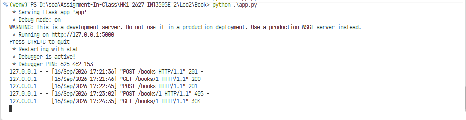
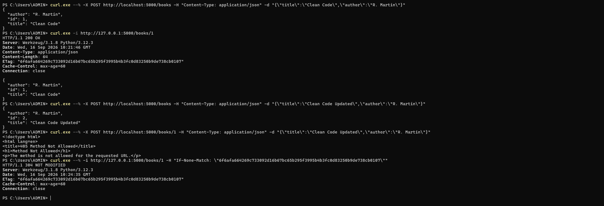

# Lec 2 - Bài tập Flask REST API

Thư mục này gồm các bài thực hành Flask REST API với resource `books`. Các bài được phát triển lần lượt từ API cơ bản đến các HTTP method, pagination, filtering, HATEOAS, cache và SQLite. Ảnh minh họa được lưu trong thư mục `../assets/`.

## Hướng dẫn chạy

```bash
pip install -r requirements.txt
python Book/app_b1.py
```

Với các bài khác, thay `app_b1.py` bằng file cần chạy: `app_method.py`, `app_prod.py` hoặc `app.py`.

Mỗi lần chỉ chạy một file. Server mặc định chạy tại `http://127.0.0.1:5000`.

## Bài 1 - GET và POST Books

**Source:** `Book/app_b1.py`

**Endpoint chính:**

- `GET /books`: trả danh sách sách
- `POST /books`: tạo sách mới với `title` và `author`

| Server | Kết quả |
| --- | --- |
|  |  |

## Bài 2 - PUT, PATCH và DELETE

**Source:** `Book/app_method.py`

**Endpoint chính:**

- `GET /books/<id>`: lấy sách theo id, cache 60 giây
- `PUT /books/<id>`: thay thế toàn bộ sách
- `PATCH /books/<id>`: chỉ cập nhật field có trong body
- `DELETE /books/<id>`: xóa sách

| Server | Kết quả |
| --- | --- |
|  |  |

## Bài 3 - Production-ready GET Books

**Source:** `Book/app_prod.py`

**Endpoint chính:**

- `GET /books?page=1&size=10`: phân trang
- `GET /books?author=...`: lọc chính xác theo tác giả
- `GET /books?q=...`: tìm kiếm trong tiêu đề
- HATEOAS links: `self`, `first`, `last`, `prev`, `next`
- Cache response: `Cache-Control: public, max-age=30`

| Server | Kết quả |
| --- | --- |
|  |  |

## Homework - Bài 1: SQLite Orders API

**Source:** `Book/app.py`

**Schema:** `Book/schema.sql`

Ứng dụng sử dụng SQLite thuần, tự tạo file `Book/orders.db` khi khởi động.

**Endpoint chính:**

- `GET /orders`: lấy danh sách đơn hàng
- `POST /orders`: tạo đơn hàng với `customer`, `total`, tùy chọn `status`
- `GET /orders/<id>`: lấy đơn hàng theo id

Ví dụ tạo order:

```bash
curl -X POST http://127.0.0.1:5000/orders \
  -H "Content-Type: application/json" \
  -d '{"customer":"Nguyen Van A","total":150000,"status":"pending"}'
```

Ảnh minh chứng cho Homework sẽ được bổ sung vào thư mục `../assets/` khi có screenshot.

## Homework - Bài 2: Liệt kê 5 endpoint

Các endpoint dưới đây được quan sát trong DevTools khi truy cập GitHub. Đây là các tài nguyên JavaScript tĩnh được phân phối qua CDN.

| STT | Endpoint | Method | Status code | Headers chính | RESTful? |
| --- | --- | --- | --- | --- | --- |
| 1 | [`global-nav-bar-73f133b31a335d5f.js`](https://github.githubassets.com/assets/global-nav-bar-73f133b31a335d5f.js) | `GET` | `200 OK` | `content-type: application/javascript`; `cache-control: public, max-age=31536000, immutable`; `etag`; `content-encoding: br`; `x-cache: HIT, HIT` | REST-like; là resource tĩnh, không phải REST API nghiệp vụ |
| 2 | [`react-reconciler-8e99e505c4429605.js`](https://github.githubassets.com/assets/react-reconciler-8e99e505c4429605.js) | `GET` | `200 OK (from disk cache)` | `content-type: application/javascript`; `cache-control`; `age`; `etag`; `vary: Accept-Encoding` | REST-like; dùng `GET` để đọc resource |
| 3 | [`react-jsx-runtime-4915cb0f5b3aff04.js`](https://github.githubassets.com/assets/react-jsx-runtime-4915cb0f5b3aff04.js) | `GET` | `200 OK (from disk cache)` | `content-type: application/javascript`; `cache-control`; `content-encoding: br`; `x-cache: HIT, HIT` | REST-like; resource được định danh bằng URL |
| 4 | [`react-dom-client-1b4a3ee065998cea.js`](https://github.githubassets.com/assets/react-dom-client-1b4a3ee065998cea.js) | `GET` | `200 OK (from disk cache)` | `content-type: application/javascript`; `cache-control`; `etag`; `age`; `x-served-by` | REST-like; request an toàn và có thể cache |
| 5 | [`selector-observer-e88088f989b27670.js`](https://github.githubassets.com/assets/selector-observer-e88088f989b27670.js) | `GET` | `200 OK (from disk cache)` | `content-type: application/javascript`; `cache-control`; `age`; `x-cache: HIT, HIT`; `vary: Accept-Encoding` | REST-like; không làm thay đổi trạng thái server |

**Nhận xét:**

- Cả 5 request đều dùng `GET`, có tính safe và idempotent.
- Các response đều thành công với status `200`.
- Header quan trọng gồm `Content-Type`, `Cache-Control`, `ETag`, `Age`, `Vary`, `Content-Encoding` và `X-Cache`.
- `Cache-Control: public, max-age=31536000, immutable` cho phép trình duyệt và CDN cache file trong một năm.
- Các endpoint có một số đặc điểm REST như resource được định danh bằng URL, stateless và cacheable. Tuy nhiên, chính xác hơn đây là static resource endpoints, không phải REST API nghiệp vụ.

## Homework - Bài 3: Conditional requests với ETag

**Source:** `Book/app.py`

`GET /books/<id>` tạo ETag bằng cách băm nội dung JSON của sách bằng SHA-256.

- Request đầu tiên trả `200 OK`, dữ liệu sách và header `ETag`.
- Request tiếp theo gửi `If-None-Match` với giá trị ETag đã nhận.
- Nếu nội dung không thay đổi, server trả `304 Not Modified` và không gửi lại response body.
- Nếu nội dung thay đổi, ETag mới được tạo và server trả lại `200 OK` cùng dữ liệu mới.

Ví dụ:

```bash
curl -i http://127.0.0.1:5000/books/1
curl -i http://127.0.0.1:5000/books/1 -H 'If-None-Match: "etag-da-nhan"'
```

| Server | Kết quả |
| --- | --- |
|  |  |

## Mã phản hồi thường dùng

- `200 OK`: yêu cầu thành công
- `201 Created`: tạo tài nguyên thành công
- `204 No Content`: xóa thành công
- `400 Bad Request`: tham số không hợp lệ
- `404 Not Found`: không tìm thấy tài nguyên
- `415 Unsupported Media Type`: request không gửi JSON
- `422 Unprocessable Entity`: dữ liệu thiếu hoặc không hợp lệ
